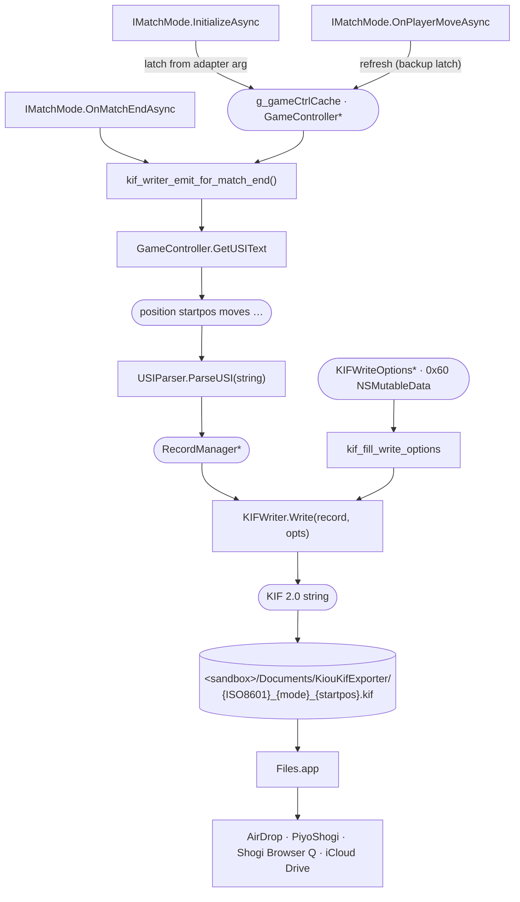

<h1 align="center">Kiou Kif Exporter</h1>

<p align="center">
  
</p>

<p align="center">
  <em>Auto-save every <strong>KIOU</strong> match as a standard KIF 2.0 file —
  straight to the Files app, ready for AirDrop or hand-off to PiyoShogi,
  Shogi Browser Q, Kifu for Windows, and the rest.<br/>
  No PC, no extra tooling — the iPhone does it all.</em>
</p>

<p align="center">
  
  
  
  
  
  
  
  
</p>

---

Kiou Kif Exporter is the simplest possible kifu pipeline for **KIOU**: the
moment a match ends, the tweak calls the app's own internal KIF writer and
drops the resulting `.kif` file into the app's `Documents/KiouKifExporter/`
folder. Files.app picks it up, AirDrop ships it to the desktop, and any
kifu viewer that understands the standard KIF 2.0 format can replay it
without one byte of pre-processing.

There is no host-side bridge, no WebSocket server, no proxy. The entire
flow lives in one ~110 KB dylib that hooks five lifecycle methods and
writes a single file per match.

### Observation-only

Kiou Kif Exporter is strictly **read-then-write**. During a match the
tweak's hooks observe `IMatchMode.InitializeAsync` and
`IMatchMode.OnPlayerMoveAsync` to keep a live `GameController*` pointer
in hand; when `IMatchMode.OnMatchEndAsync` fires, the tweak asks KIOU's
own `KIFWriter.Write` for the finished kifu and writes the resulting
string to disk. That's all.

The tweak never:

- writes back into `GameController`, `RecordManager`, or any other
  in-memory game state,
- alters which side wins, the move list, the result reason, or the
  on-screen replay,
- opens a socket, talks to the KIOU backend, or sits on the network
  path in any form.

The only piece of state Kiou Kif Exporter creates is a single `.kif`
file per match, inside the app's own sandbox at
`Documents/KiouKifExporter/`. Uninstalling the dylib returns KIOU to a
fully vanilla state and leaves your existing `.kif` files alone until
you delete them yourself.

## What you get

For every match you play — VsAI, CPU Stream, Online PvP, Local PvP, or
even Record Replay — a file lands at:

```
<KIOU sandbox>/Documents/KiouKifExporter/{ISO8601_UTC}_{mode}_{startpos}.kif
```

Example file name:

```
20260615T004046_CPUStreamMode_startpos.kif
```

Where:

| Segment | Meaning |
|---|---|
| `ISO8601_UTC` | UTC timestamp, `yyyyMMdd'T'HHmmss` — filename-safe, sorts lexicographically. |
| `mode` | One of `AIMatchMode`, `CPUStreamMode`, `OnlinePvPMode`, `LocalPvPMode`, `RecordReplayMode`. |
| `startpos` | `startpos` for a standard initial position, otherwise `sfen-<8 hex>` (SHA-1 prefix of the starting SFEN — handicaps, custom positions, etc). |

The file itself is the canonical KIF 2.0 format produced by KIOU's own
internal `KIFWriter.Write`. Concretely:

```text
# ----  KIF形式  ----
手合割：平手
手数----指手---------消費時間--
   1 ２六歩(27)
   2 ２四歩(23)
   3 ２五歩(26)
   ...
  19 同　竜(21)
  20 ７二玉(71)
  21 ６二銀打
```

Every desktop and iOS kifu viewer that reads `.kif` reads this — verified
against PiyoShogi (iOS) and Kifu for Windows on a standard install. No
re-encoding, no charset conversion: UTF-8 in, UTF-8 out.

### What the KIF header carries

`KIFWriteOptions` is populated at match end with metadata pulled from
the live `MatchConfig`, `GameStateStore` and `GameController`. Every
desktop and iOS viewer that reads `.kif` honors these rows.

| Header | Source |
|---|---|
| `先手：<name>` / `後手：<name>` | `GameStateStore._blackPlayerInfo` / `_whitePlayerInfo` (`ReactiveProperty<PlayerInfo>` at +0x50 / +0x58 → currentValue at +0x20 → `Name`), with a fallback to `MatchConfig.<Black|White>Player.Name` for AI / local / replay modes. |
| `開始日時：YYYY/MM/DD HH:MM:SS` | Wall-clock `NSDate` captured at `InitializeAsync`, packed into a `Nullable<DateTime>` tick value at the match-end fill. |
| `棋戦：<title>` | Synthesized as `"{mode} @ {iso8601}"` (e.g. `OnlinePvPMode @ 20260615T193557`) via `il2cpp_string_new`. |
| `持ち時間：<label>` | `kif_build_time_rule_label` from `MatchConfig.TimeControl` (e.g. `1500秒+秒読み60秒`). |
| `まで○○手で<reason>` ending label | `kif_winreason_label(GameController.<Reason>k__BackingField)` mapped to `投了` / `詰み` / `時間切れ` / `千日手` etc. |

The one slot still intentionally NULL is **per-move consumption times**
(`KIFWriteOptions.ThinkingTimesMicros`). The KIF body is still valid
without it; only the `(M:SS/HH:MM:SS)` annotation is absent. This is
queued for v0.4 — see [Roadmap](#roadmap).

Full implementation map — including each setter RVA, the field offsets,
and the il2cpp string / List bridging plan — lives in
[`docs/plans/kiou_kif_exporter.md`](../../../docs/plans/kiou_kif_exporter.md)
in the repository root.

## How it works



Five concrete `IMatchMode` implementations are hooked, three lifecycle
methods each — fifteen `MSHookFunction` / `DobbyHook` installs in total:

| Hook | Purpose |
|---|---|
| `InitializeAsync` | Latch `GameController` from the `ShogiGameAdapter` argument. |
| `OnPlayerMoveAsync` | Backup latch in case `InitializeAsync` handed us a NULL adapter. |
| `OnMatchEndAsync` | Run the KIF pipeline and write the file — **before chaining to the original**, while the GameController is still alive. |

The write is synchronous and blocks the OnMatchEndAsync handler for the
duration of a single `KIFWriter.Write` call (typically sub-millisecond).
After the file lands, the original `OnMatchEndAsync` runs as usual and
KIOU teardown proceeds.

## Install

Pick the row that matches how your device is signed.

### Jailbroken (rootless — Dopamine / palera1n)

Easiest path. The dylib ships as a regular `.deb` and is loaded by
`MobileSubstrate` / `ElleKit` on next launch.

1. Download the latest `work.tkgstrator.kioukifexporter_<ver>_iphoneos-arm64.deb`
   from the [Releases page](https://github.com/IPA-Patch/KiouKifExporter/releases).
2. Open the `.deb` in **Sileo** (or **Zebra** / **Cydia**) and install.
3. Respring or relaunch KIOU.
4. To get the saved `.kif` files into Files.app, follow
   [Files-app exposure on jailbreak](#files-app-exposure-on-jailbreak) once.
   You only need to do this the first time the tweak is installed; the
   `Info.plist` change survives KIOU updates as long as the bundle UUID
   doesn't change.

Filza users can already see `.kif` files at
`/var/mobile/Containers/Data/Application/<UUID>/Documents/KiouKifExporter/`
even without that Info.plist tweak.

### TrollStore

Single bundle — patch the IPA's `Info.plist` first so Files.app sees the
sandbox, then inject the dylib and install. TrollStore's permanent
signature covers any modification you make to the bundle on disk, so
the resulting install is stable.

1. Extract a decrypted KIOU IPA to a working directory.
2. Open `Payload/KIOU.app/Info.plist` and add (or, in Plist Editor, tick):
   ```xml
   <key>UIFileSharingEnabled</key>
   <true/>
   <key>LSSupportsOpeningDocumentsInPlace</key>
   <true/>
   ```
3. Copy `KiouKifExporter.dylib` into `Payload/KIOU.app/Frameworks/` and
   inject it with [`insert_dylib`](https://github.com/Tyilo/insert_dylib)
   or [`optool`](https://github.com/alexzielenski/optool):
   ```sh
   insert_dylib --weak --inplace --no-strip-codesig \
     '@executable_path/Frameworks/KiouKifExporter.dylib' \
     Payload/KIOU.app/KIOU
   ```
4. Re-zip as `KIOU-KifExporter.ipa` and open it from Files.app on the
   device; TrollStore picks it up.
5. Launch KIOU. The `.kif` folder appears in Files.app under
   **On My iPhone -> KIOU -> KiouKifExporter** once the first match
   finishes.

### Sideloadly / AltStore / Apple Developer Program

Self-signed certificates expire (7 days for a free Apple ID, 1 year for
a paid Developer Program account). Each refresh re-signs the same IPA, so
the inject + plist tweak only has to happen once.

1. Open Sideloadly and drop a decrypted KIOU `.ipa` onto it.
2. Switch to the **Advanced** pane.
3. Tick **Enable File Sharing** — Sideloadly injects
   `UIFileSharingEnabled` and `LSSupportsOpeningDocumentsInPlace` into
   the `Info.plist` for you.
4. Under **Inject dylibs**, click **Add** and pick the
   `KiouKifExporter.dylib` you downloaded from the Releases page (the
   `make jailed` artifact).
5. Sign with your Apple ID and install.

AltStore is identical: drop the IPA into AltStore, then before signing
go into **Settings -> Advanced** and add the dylib + tick file sharing.

> **Note (iOS 18):** iOS 18's Code Signing Monitor (CSM) kills any inline
> hook before the dylib's constructor runs, so the runtime-hook variants
> above (MobileSubstrate, Dobby-static via Sideloadly) stop working on
> non-jailbroken iOS 18 devices. Use the **statically-patched IPA** path
> below instead.

### Statically-patched IPA (TrollStore / Sideloadly / AltStore on iOS 18)

For non-jailbroken iOS 18 — and as a generally safer option on any
iOS — Kiou Kif Exporter publishes hook function pointers into a
reserved `__DATA` slot of a statically-patched UnityFramework, so
every `IMatchMode.OnMatchEndAsync` calls into the dylib without
needing any runtime hook engine. The patched IPA is **assembled on
your own host** from a decrypted KIOU `.ipa` you supply — the
project never redistributes a re-bundled KIOU binary.

1. Download
   `KiouKifExporter-<ver>-binpatch.dylib` from the
   [Releases page](https://github.com/IPA-Patch/KiouKifExporter/releases).
   This is the binpatch flavor of the dylib (Dobby-static, slot-publisher
   constructor — not the runtime-hook `-jailed.dylib`).
2. On your host, drop a decrypted KIOU `.ipa` at
   `assets/Kiou-1.0.1.ipa` (or pass `DECRYPTED_IPA=` explicitly) and
   build the patched IPA — see [Build > Patched IPA](#patched-ipa-distribution).
   This rewires UnityFramework, adds an `LC_LOAD_DYLIB` for the dylib,
   and re-zips into `packages/ipa/KiouKifExporter-binpatch.ipa`.
3. Install the resulting IPA through your usual non-JB channel —
   TrollStore, Sideloadly, AltStore, or an Apple Developer Program
   signing flow.
4. Launch KIOU. The KIF folder shows up in Files.app under
   **On My iPhone -> KIOU -> KiouKifExporter** after the first match.

The patched IPA already has `UIFileSharingEnabled` and
`LSSupportsOpeningDocumentsInPlace` enabled, so no further Info.plist
edits are needed.

## Files app integration

The destination path uses `NSSearchPathForDirectoriesInDomains(NSDocumentDirectory, ...)`,
which resolves to the running app's sandbox `Documents` directory. For
Files.app to expose it, the KIOU bundle needs:

```xml
<key>UIFileSharingEnabled</key>
<true/>
<key>LSSupportsOpeningDocumentsInPlace</key>
<true/>
```

These keys are **absent from the retail KIOU `Info.plist`**, so on a stock
install Files.app will not show a KIOU section even though the dylib is
faithfully writing `.kif` files. There are three ways to fix that:

| Distribution | How to enable |
|---|---|
| **Jailbreak (rootless)** | Edit `Info.plist` in-place (see [Files-app exposure on jailbreak](#files-app-exposure-on-jailbreak) below). |
| **TrollStore** | Edit the `Info.plist` inside your locally-extracted `.ipa` before installing, then `TrollStore` accepts the modified bundle outright (CoreTrust exploit covers the Info.plist hash mismatch). |
| **Sideloadly / AltStore / Apple Developer Program** | Check **"Enable File Sharing"** in Sideloadly when sideloading; it injects both keys automatically. |

### Files-app exposure on jailbreak

For development on a jailbroken device, edit the `Info.plist` directly.
**Do not run `ldid -S` against the KIOU Mach-O** — it will strip the
existing code-signature and AMFI will refuse to launch the app.

```sh
# 1. Backup
APP=/var/containers/Bundle/Application/<UUID>/KIOU.app
cp -p $APP/Info.plist $APP/Info.plist.bak

# 2. Patch (on host, in Python)
python3 - <<'PY'
import plistlib
with open('Info.plist','rb') as f:
    pl = plistlib.load(f)
pl['UIFileSharingEnabled'] = True
pl['LSSupportsOpeningDocumentsInPlace'] = True
with open('Info.plist','wb') as f:
    plistlib.dump(pl, f, fmt=plistlib.FMT_XML)
PY

# 3. scp back, then re-register and relaunch
scp Info.plist root@<device>:$APP/Info.plist
ssh root@<device> "uicache -p $APP && open com.neconome.shogi"
```

Most jailbreak AMFI bypasses tolerate the `_CodeSignature/CodeResources`
mismatch the edit introduces — there is no need to re-sign anything.

## Compatibility

This build targets:

| | |
|---|---|
| **KIOU app version** | `1.0.1` (`CFBundleVersion` 11) |
| **iOS** | 15.0 – 17.x for the Substrate / Dobby runtime-hook paths, arm64. iOS 18.x is supported via the [statically-patched IPA](#statically-patched-ipa-trollstore--sideloadly--altstore-on-ios-18) path only — iOS 18's CSM kills runtime inline hooks before the dylib's constructor can run. |

All hooks are pinned to RVAs from this exact KIOU build's `UnityFramework`
binary. After a KIOU update the RVAs will drift and the tweak will silently
no-op (or, worst case, crash on a method whose signature changed). **Don't
install this dylib against a KIOU version other than the one above without
re-deriving every RVA first.**

## Requirements

- [Theos](https://theos.dev/) with the standard iOS toolchain installed
  (`$THEOS` set). Kiou Kif Exporter is pure Objective-C — no Orion, no
  Swift runtime.
- iOS 15.0–18.x, arm64. Runtime-hook paths (`make package` /
  `make jailed`) target iOS 15–17; the patched-IPA path (`make ipa`)
  covers iOS 18.
- For the sideload / patched-IPA paths: a decrypted copy of the KIOU
  `.ipa`. The patched-IPA build also needs Python 3.10+ on the host
  (the recipe driver under `recipes/` and `shared/tools/`).

## Build

### Jailbroken device (rootless)

Produces a `.deb` that installs to
`/var/jb/Library/MobileSubstrate/DynamicLibraries/`.

```sh
make package
# install over SSH (password: alpine on first run, then key-based)
make package install THEOS_DEVICE_IP=<device-ip>
```

### Jailed device (sideload, iOS 15–17)

Produces a bare dylib for injection via Sideloadly / AltStore / Apple
Developer Program. The dylib statically links Dobby so it has zero hook-
engine dependency at install time.

```sh
make jailed
# -> packages/jailed/KiouKifExporter.dylib
```

### Patched IPA distribution

For non-jailbroken iOS 18 (and as a more robust option on any iOS),
build a statically-patched IPA that publishes hook function pointers
into a reserved `__DATA` slot. No runtime hook engine is involved, so
iOS 18's CSM has nothing to flag.

```sh
make ipa DECRYPTED_IPA=/path/to/decrypted-kiou.ipa
# -> packages/ipa/KiouKifExporter-binpatch.ipa
```

What `make ipa` does:

1. Builds `packages/binpatch/KiouKifExporter.dylib` (same link shape as
   `make jailed` but with `-DIPA_BINPATCH=1` so the constructor writes
   hook function pointers into a reserved `__DATA` slot instead of
   trying to inline-rewrite `__TEXT`).
2. Runs `shared/tools/build_patched_ipa.sh` driven by the recipe at
   `recipes/kioukifexporter.py` — adds an `LC_LOAD_DYLIB` for the
   dylib, reserves the slot, and rewrites the prologue of every
   `IMatchMode.OnMatchEndAsync` to branch into a cave that calls the
   hook through the slot.
3. Patches the bundled `Info.plist` so Files.app exposes the sandbox
   automatically, then re-zips into a TrollStore / Sideloadly / AltStore
   / Developer-Program-ready IPA.

This pipeline never redistributes the decrypted KIOU `.ipa`; you supply
your own via `DECRYPTED_IPA=`.

The `make jailed` target also prints an `otool -L` of the resulting
binary; it must **not** mention `libsubstrate` or `libdobby`.

Sideloadly install:

1. Build with `make jailed`.
2. In Sideloadly, load the decrypted KIOU `.ipa`.
3. Add `packages/jailed/KiouKifExporter.dylib` under **Inject dylib**.
4. Tick **Enable File Sharing** so Files.app picks the sandbox up.
5. Sign with your Apple ID / certificate and install.

## Where the logs go

The dylib writes its own diagnostic log into the KIOU sandbox:

```
<KIOU sandbox>/tmp/kioukifexporter.log
```

— which translates to `/var/mobile/Containers/Data/Application/<UUID>/tmp/kioukifexporter.log`
on a jailbroken device. Tail it over SSH to watch matches resolve in
real time:

```sh
ssh root@<device-ip> 'tail -F /var/mobile/Containers/Data/Application/*/tmp/kioukifexporter.log'
```

Each match produces a tidy run of `[MMODE]` lifecycle lines and a final
`[KIF] wrote <N> bytes -> ...` confirmation.

## Roadmap

| Phase | Scope |
|---|---|
| **v0.1** | All 15 `IMatchMode` hooks installed, KIF pipeline live, file naming, sandbox output. `KIFWriteOptions` shipped all-null. |
| **v0.2** | `BlackPlayerName` / `WhitePlayerName` / `StartDateTime` / `MatchTitle` / `TimeRuleLabel` / `EndingLabel` filled at match end. Player names come from `GameStateStore._blackPlayerInfo` / `_whitePlayerInfo` (the same `ReactiveProperty` the on-screen UI reads), with a `MatchConfig` fallback for AI / local / replay modes. |
| **v0.3** (current) | Statically-patched IPA pipeline (`make ipa`) — bakes the same hook chain into a patched `UnityFramework` and reserves a `__DATA` slot, so non-jailbroken iOS 18 installs (where CSM kills runtime inline hooks) keep working without Dobby. The runtime-hook builds (`make package` / `make jailed`) keep covering iOS 15–17. |
| **v0.4** | Per-move consumption times via `mach_absolute_time()` accumulation + `List<long>..ctor()` / `Add(long)` to build `KIFWriteOptions.ThinkingTimesMicros` — restores the `(M:SS/HH:MM:SS)` annotation on each move. |
| **v0.5** | In-app settings sheet — a floating button opens a `UIViewController` overlay (same window-overlay pattern as KiouEditor) where the user can toggle auto-save per match mode (`AIMatchMode`, `CPUStreamMode`, `OnlinePvPMode`, `LocalPvPMode`, `RecordReplayMode`). Selections are persisted in `NSUserDefaults`; `OnMatchEndAsync` checks the flag and returns early if the mode is disabled. |

## Sibling tweaks

Kiou Kif Exporter shares its il2cpp helpers and logging plumbing with two
sister projects you can install side-by-side. All three can coexist in the
same KIOU process:

- [**Kiou Editor**](https://github.com/IPA-Patch/KiouEditor) — the
  client-side customization suite (item unlock, premium gating, engine
  tuning, voice unlock, etc).
- [**Kiou Engine Bridge**](https://github.com/IPA-Patch/KiouEngineBridge) —
  bridges KIOU to a USI shogi engine (YaneuraOu and friends) so you can
  drive a desktop-grade analysis engine against the live board straight
  from the device.

## License

Released under the [MIT License](LICENSE) — see the `LICENSE` file for the
full text.

### Scope of use

Intended for **authorized penetration testing and personal research**. The
repository ships no proprietary KIOU assets and does not distribute the
IPA — sourcing a decrypted copy of KIOU for the sideload path is the
reader's responsibility. Treat this dylib as a research-grade observation
tool; don't redistribute the resulting `.kif` files in ways the rights
holders would object to.
